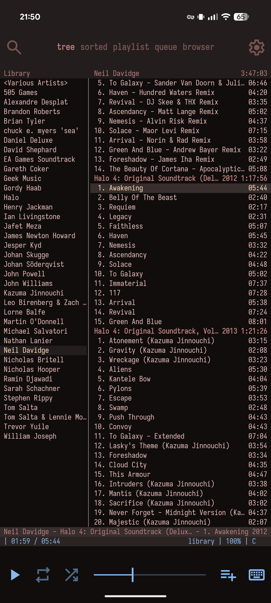
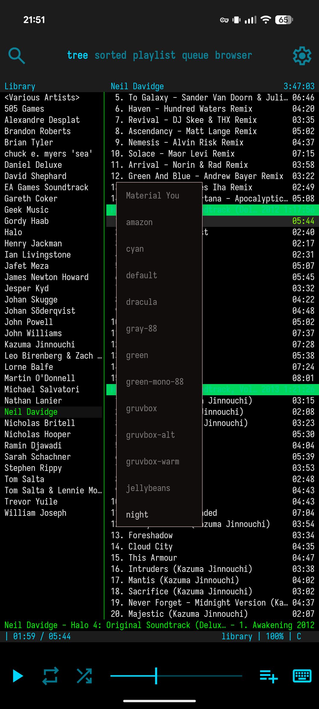
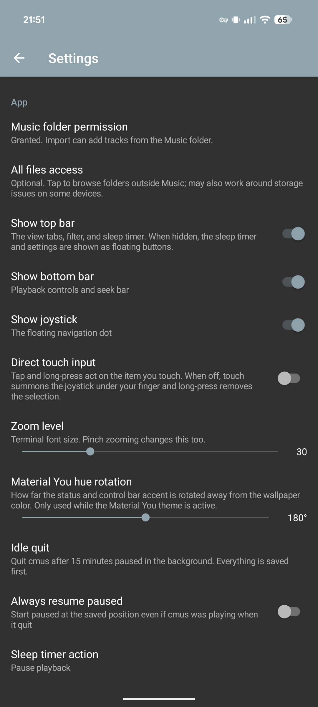
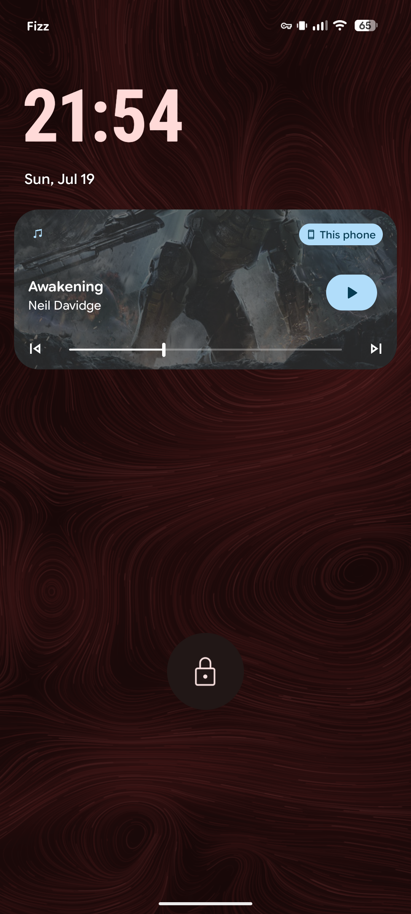

# cmus-android

[](https://github.com/pgaskin/cmus-android/actions/workflows/ci.yml)

Port of [cmus](https://github.com/cmus/cmus) for Android with system integration and some extra UI features.

I mostly vibe-coded this since it's pretty much all glue code, the extra features are relatively simple and well-defined, and the rest is mostly custom UI components and gesture handling, which are annoying to do by hand.

Although the code is almost entirely written and maintained by Claude, I made most of the higher-level architectural decisions and came up with the features to implement myself, and I read almost all of the thinking output. In addition, I already have a deep understanding of cmus (I'm one of the maintainers) and am able to point out the more subtle things.

I already did most of the actual porting work earlier to make it work well on Termux, including the AAudio output plugin, portability and build fixes, playlist env var stuff, and so on. This project is mostly the UI and system integration.

[**`Download`**](https://github.com/pgaskin/cmus-android/releases/latest)

### Screenshots

<table><thead><tr><td>



</td><td>



</td><td>



</td><td>



</td></tr></thead></table>

<small>

*Like the wallpaper? See [github.com/pgaskin/windy](https://github.com/pgaskin/windy) (this one isn't vibe-coded).*

</small>

### Features

- Supports Android 14+.
- Additional touch-friendly UI components.
  - Top bar with live-filter, views, and settings.
  - Bottom bar with play/repeat/shuffle/seek/volume/queue/keyboard.
  - Long-press tracks/playlists to add/remove.
  - Joystick for scrolling and switching panes/views.
  - Graphical settings view for most relevant settings.
- System integration.
  - System media controls and metadata.
  - Stops the cmus process after being idle for a bit to save power, automatically restarting it when focused or media buttons are used.
  - Material You color scheme.
  - Music from external storage.
  - UI colors match cmus theme.
  - Audio ducking.
  - Library paths are relative to data dirs so import/export works correctly.
- Extra features.
  - Album art support.
  - Sleep timer.
  - Font options.
  - Data import/export.
  - Sub-second seeking accuracy.
  - Continuously saves state.
- Optimized for power efficiency.

### Building

The Android SDK, NDK, CMake, and Git are required. Building on Windows may work, but isn't tested.

```bash
# android sdk dependencies
sdkmanager 'cmake;3.30.5' 'ndk;28.2.13676358' 'build-tools;36.0.0'

# sync submodules
git submodule update --init

# apply submodule patches
# note: do not commit the updated submodules
./patch.sh

# build app
./gradlew assembleDebug
```

### Development

To update the vendored libs, you'll also need gperf and tic on the host system. After updating the submodules, check for any required build system or codegen changes, then re-run the `gen.sh` scripts.

Patches to vendored libs are managed using a small helper script (similar to what I did for [vncpatch](https://github.com/pgaskin/vncpatch)). To add new patches or modify existing ones, commit them as usual in the submodules, then run the patch script again and commit the generated patch files.

```bash
# tag pinned commit as the base one, apply/update patch files
./patch.sh

# verify that submodules have all patches applied
./patch.sh check

# for a single submodule
./patch.sh cmus
```

The existing build system for vendored libs is not used unless it's a well-designed CMake one which can easily be integrated. For most libs, I do a new CMake config from scratch.

In most cases, Gradle will automatically pick up changes to the libs and build scripts as required.

If using a LLM, have it start by reading [status.md](./notes/status.md). The notes folder is all LLM-written except for the inital spec. This README is hand-written.

### Troubleshooting

If cmus fails to start, there are reset options with various levels of granularity in the settings page.

If you aren't able to load tracks from your Music directory (or want to use a different directory), grant the all files access permission on the app settings, then restart it.

There are also debug options in settings for troubleshooting the internal IPC socket.

The debug logs from cmus itself are only visible on debuggable builds and need to be explicitly enabled in settings.

If cmus appears frozen, and the native UI is responsive but doesn't do anything, cmus probably is stuck or crashed. You'll need to force-stop the app and restart it. If you open an issue and have a rooted device, try to include a stack trace.
